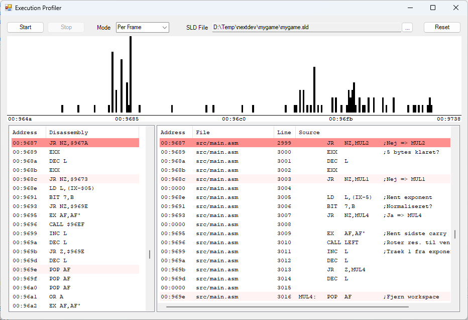

# CSpectPluginLib
CSpect Plugin Library

## Plugins
### Execution Profiler
Source level code profiler

The profiler has 2 profiling modes
* **Per Frame** - profile instructions based on how often they are busy when the frame interrupt occurs.
* **Every Execution** - profile instructions based on how often they are executed.

Support for loading sjasmplus SLD files to provide source-level profiling data.

